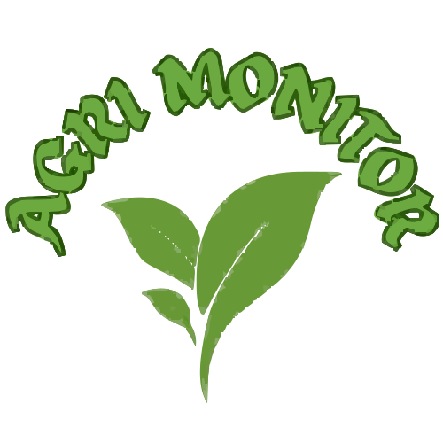

<p align="center">
  
</p>

<h1 align="center">Agri Monitor</h1>

<p align="center">
  <strong>Pakistan's #1 AI-Powered Agricultural Monitoring Platform</strong><br />
  Smart crop management, real-time weather intelligence, market rates and AI-driven insights — all in one dashboard.
</p>

<p align="center">
  <a href="https://test1936.netlify.app/">
    
  </a>
  
  
  
  
</p>

---

## Table of Contents

- [About](#about)
- [Features](#features)
- [Tech Stack](#tech-stack)
- [Project Structure](#project-structure)
- [Getting Started](#getting-started)
- [Environment Variables](#environment-variables)
- [Deployment](#deployment)
- [Scripts](#scripts)

---

## About

**Agri Monitor** is a full-featured web application built to help farmers and agronomists manage their crops from sowing to harvest. By simply registering a crop and its sowing date, the platform generates personalised daily tasks, AI-powered recommendations, irrigation schedules, growth timelines, weather alerts and market intelligence — all tailored to the individual field.

The platform connects to external AI endpoints for intelligent analysis (crop disease detection from photos, recommendation generation, timeline planning) and stores all user data securely in Firebase (Authentication + Firestore + Realtime Database).

> **Live URL:** [https://test1936.netlify.app/](https://test1936.netlify.app/)

---

## Features

### Dashboard

| Module | Description |
|--------|-------------|
| **Dashboard Home** | Overview of all crops, quick-start guide cards and navigation to every dashboard section. |
| **Add New Crop** | Register a crop with its sowing date, image and field details to unlock all AI features. |
| **Crop Progress** | Today's tasks, mark them done, log field activities and record daily crop condition. |
| **Crop Timeline** | Full lifecycle plan — germination, vegetative, flowering, maturity stages with estimated harvest date. |
| **Crop Suggestion** | AI recommendations for irrigation, nutrition, pest & disease monitoring matched to your crop's real data. |
| **Weather Forecast** | Hourly and daily forecasts with farming-specific guidance for irrigation, spraying and harvest planning. |
| **Weather Alerts** | Proactive warnings for heavy rain, heatwaves, frost and wind that can affect your crops. |
| **Disaster Alerts** | Regional disaster feed with impact analysis, maps and safety recommendations. |
| **Global Market Rates** | World commodity prices from a live market feed with watchlist, price alerts, comparison and AI decision support. |
| **AI Chatbot** | Floating assistant on every dashboard page — ask about crop diseases, weather or care, and attach photos for AI analysis. |

### Public Pages

- **Home** — Hero video, feature highlights, blog section and call-to-action.
- **Features** — Detailed breakdown of platform capabilities.
- **Services** — Overview of all agri-services offered.
- **Blogs** — Agricultural knowledge articles.
- **Contact Us** — Get in touch form.
- **Login / Sign Up** — Firebase Authentication with Google sign-in support.

---

## Tech Stack

| Layer | Technology |
|-------|------------|
| **Framework** | React 19 |
| **Build Tool** | Vite 8 |
| **Styling** | Tailwind CSS 4 |
| **UI Components** | shadcn/ui (Radix UI primitives + class-variance-authority) |
| **Icons** | Lucide React |
| **Routing** | React Router DOM 7 |
| **Backend / Auth** | Firebase (Authentication, Firestore, Realtime Database) |
| **Forms** | React Hook Form |
| **Markdown** | react-markdown + remark-gfm |
| **Image Processing** | browser-image-compression |
| **Deployment** | Netlify (Node 22 runtime) |

---

## Project Structure

```
agrimonitor/
├── public/                  # Static assets (logos, favicon)
├── router/                  # Routing configuration & layouts
│   ├── routers.jsx          # All route definitions
│   ├── layout.jsx           # Public pages layout (Navbar + Footer)
│   ├── dashboardLayout.jsx  # Dashboard layout (Sidebar + Chatbot)
│   └── lazyWithRetry.js     # Chunk-failure self-healing wrapper
├── src/
│   ├── assets/              # Images, backgrounds, videos
│   ├── components/          # Shared UI components
│   │   └── ui/              # shadcn/ui primitives (button, card, dialog, etc.)
│   ├── dashboard/           # Dashboard pages & sub-components
│   │   ├── marketplace/     # Global Market Rates sub-components
│   │   ├── timeline/        # Crop timeline sub-components
│   │   ├── weather/         # Weather forecast sub-components
│   │   ├── disasteralerts/  # Disaster alert sub-components
│   │   └── ...              # Other dashboard pages
│   ├── features/            # Auth context, protected routes
│   ├── lib/                 # Utility functions & helpers
│   ├── pages/               # Public pages (home, login, services, etc.)
│   ├── services/            # AI & data services (timeline, weather, market, etc.)
│   └── styles/              # Global CSS & shadcn theme
├── .env.example             # Environment variable template
├── .env.production          # Production env values (committed)
├── netlify.toml             # Netlify build & redirect config
├── vite.config.js           # Vite configuration
└── package.json
```

---

## Getting Started

### Prerequisites

- **Node.js** >= 22.12.0 (Vite 8 requirement)
- **npm** >= 10

### Installation

```bash
# Clone the repository
git clone https://github.com/your-username/agrimonitor.git
cd agrimonitor

# Install dependencies
npm install

# Create your local environment file
cp .env.example .env.local
```

### Running Locally

```bash
npm run dev
```

The app will be available at `http://localhost:5173` (or the next available port).

### Building for Production

```bash
npm run build
```

The production-ready output will be in the `dist/` directory.

---

## Environment Variables

Copy `.env.example` to `.env.local` and fill in the values:

| Variable | Purpose | Consumed By |
|----------|---------|-------------|
| `VITE_API_URL` | Chatbot AI endpoint (POST) | `src/components/chatbots.jsx` |
| `VITE_DASHBOARD_URL` | Dashboard AI endpoint (timeline, image analysis, recommendations) | `src/services/timelineGenerator.js` |
| `VITE_WEBHOOK_URL` | Notification webhook URL | Weather Alert notifications |
| `VITE_DISASTER_API_URL` | Disaster alert feed (leave empty for mock data) | `src/services/disasterAlertService.js` |
| `VITE_MARKET_API_URL` | Global commodity market feed | `src/services/marketRateService.js` |

> **Note:** `.env.local` is gitignored. For Netlify deployments, add all variables to `.env.production` (committed) or set them in the Netlify UI under Site Configuration > Environment Variables.

---

## Deployment

The project is configured for **Netlify** deployment:

- **Build command:** `npm run build`
- **Publish directory:** `dist`
- **Node version:** 22
- **SPA fallback:** `/* → /index.html` (status 200) for deep-link support
- **Cache strategy:** HTML files are never cached; hashed assets are cached for 1 year

[](https://app.netlify.com/start)

---

## Scripts

| Command | Description |
|---------|-------------|
| `npm run dev` | Start the development server with HMR |
| `npm run build` | Build the app for production |
| `npm run preview` | Preview the production build locally |
| `npm run lint` | Run ESLint on all source files |

---

## Market API

The Global Market Rates page fetches commodity data from:

```
https://test1936.netlify.app/.netlify/functions/market
```

This endpoint returns world commodity reference prices used by the marketplace dashboard for price tracking, watchlist management, comparison and AI-powered market insights.

---

<p align="center">
  Built with care for the farming community.
</p>
